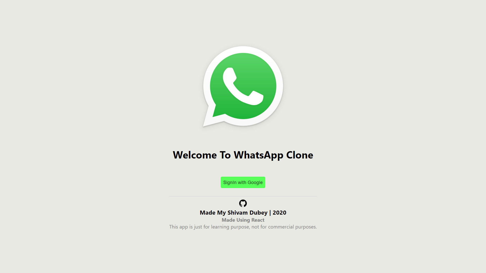
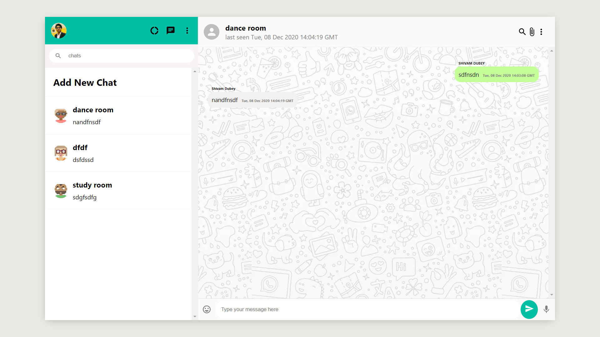

# WhatsApp web app
- A WhatsApp web app clone with google authentication


## Technologies used
 React js, Firebase for deploy, Firebase Firestore for database, Firebase Google Authentication, React Hooks, React Context API, React Router, styled-components, and material-ui icons

## Working
1). Login page

<p align = "center"> <br/>

 
2). Main App having different chat rooms.
<p align = "center"> <br/>


## Devlopment

```
$ npm install && npm start
```


